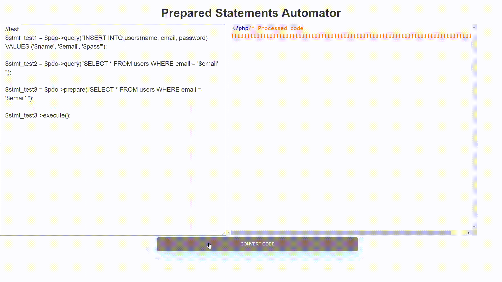

# Prepared-Statements-Automator-PHP
Web-based Prepared Statements Automator tool that helps PHP developers protect their projects from SQL Injection attacks.

## Built With
- PHP

## Preview

## Demo
<a target="_blank" href="https://mahmudmardini.bartinrehberi.info/projects/prepared-statements-automator/">View Demo</a>

## License
[MIT](LICENSE)
